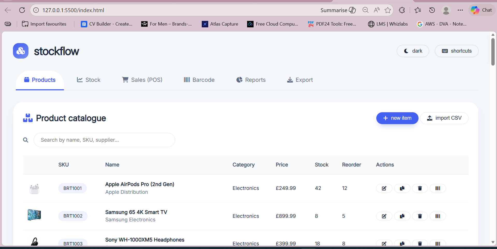
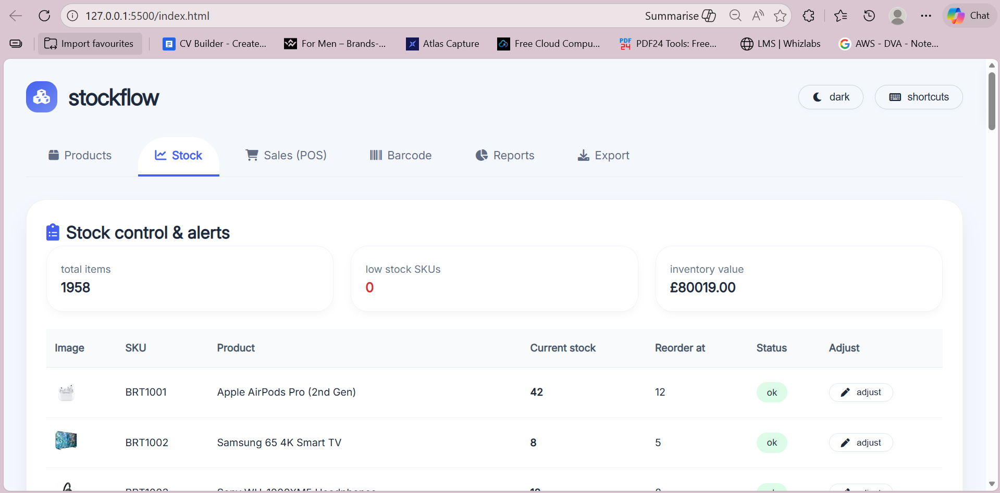

# Stockflow - Small Business Inventory Manager

## What Is This App?

Stockflow is a complete inventory management system for small businesses.

It helps you:

- Track products  
- Manage stock levels  
- Process sales  
- Generate barcodes  
- Create reports  
- Export and backup data  

Everything works in one clean and simple interface.

All data is stored in your browser.  
No internet connection is required.

---

## Main Features

### 1. Product Management

- View all products in a table  
- See pictures, SKU, category, price, and stock  
- Add new products  
- Edit existing products  
- Delete products with confirmation  
- Duplicate products  
- Real-time search  
- 50 sample products included  

---

### 2. Stock Tracking

- See current stock levels  
- Low stock items turn red  
- Out of stock indicator  
- Adjust stock (add, remove, or set quantity)  
- Stock history log  
- Dashboard with totals and inventory value  

---

### 3. Sales Tracking (POS)

- Scan barcode to add items to cart  
- 30 sample sales included  
- View sales history  
- Process returns  
- Daily sales trend chart  

---

### 4. Barcode Generator

- Auto-generate barcodes  
- View barcode for any product  
- Print barcode labels as PDF  
- Scan simulation using SKU  

---

### 5. Reports and Analytics

- Dashboard with key numbers  
- Sales trend chart  
- Category pie chart  
- Stock status chart  
- Export reports as PDF or CSV  
- Print reports  

---

### 6. Export and Backup

- Export to Excel (CSV)  
- Export to PDF  
- Backup as JSON  
- Restore from JSON backup  

---

### 7. Extra Features

- Dark mode toggle  
- Keyboard shortcuts  
- Toast notifications  
- Confirmation popups  
- Responsive design (desktop and tablet)  
- Works offline  

Keyboard shortcuts:

- Ctrl + P — Products  
- Ctrl + S — Sales  
- Ctrl + E — Export  
- Ctrl + B — Barcode  
- Ctrl + D — Dark mode  
- Ctrl + N — New product  

---

## How To Use

### Navigation

Use the tabs at the top:

- Products  
- Stock  
- Sales  
- Barcode  
- Reports  
- Export  

---

### Add a Product

1. Go to Products  
2. Click "New Item"  
3. Fill in details  
4. Click "Add Product"  

---

### Adjust Stock

1. Go to Stock  
2. Click "Adjust"  
3. Choose add, remove, or set  
4. Enter quantity  
5. Click "Apply"  

---

### Find a Product

1. Go to Products  
2. Type in the search box  
3. Results update instantly  

---

### Generate a Barcode

1. Click barcode icon on any product  
2. Barcode page opens automatically  

---

### Export Data

1. Go to Export  
2. Choose Excel, PDF, or JSON  
3. File downloads automatically  

---

## Screenshots

